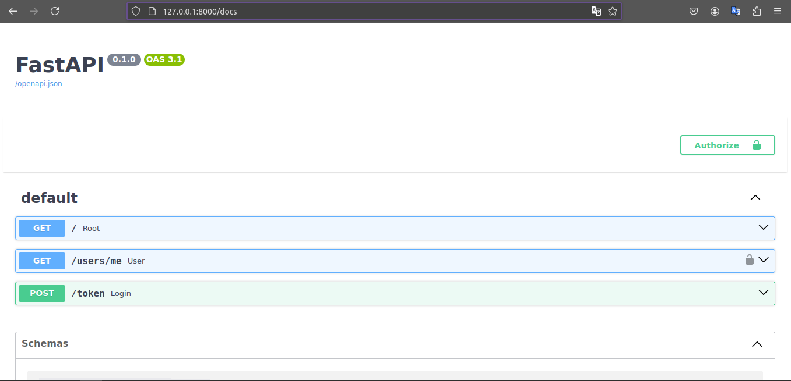

<h1>Autenticación simple con OAuth2 en FastAPI</h1>

<h2>Instrucciones</h2>
<h3>Clona el repositorio</h3>
<li>git init</li>
<li>git clone https://github.com/joshuboshu/fastapi-simple-auth.git</li>
<h3>Luego ejecuta los siguientes comandos</h3>
<li>pip install -r requirements.txt</li>
<li>uvicorn main:app --reload</li>

<h2>Detalles del programa</h2>
<li>Ingresa en tu navegador</li>
<li>Copia y pega esta ruta http://127.0.0.1:8000/docs</li>
<li>A continuación estarás en el Swagger de FastAPI</li>

